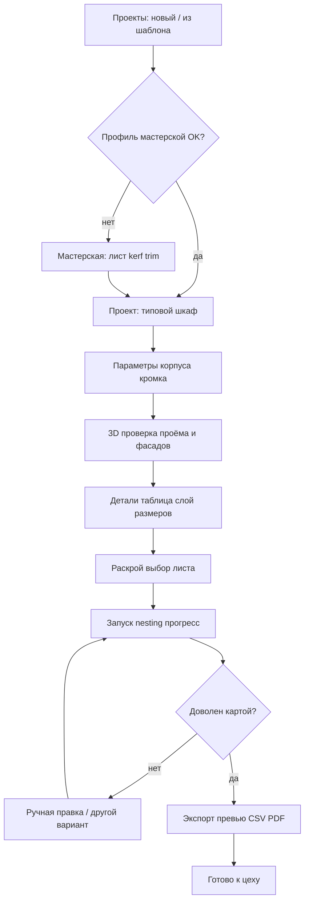
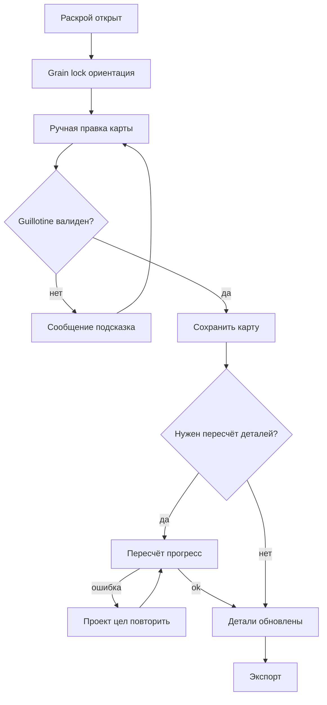
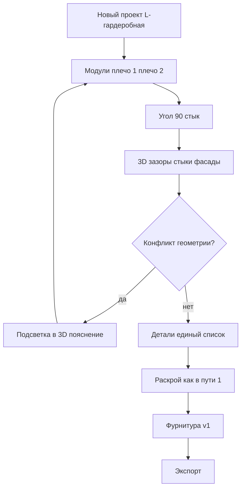
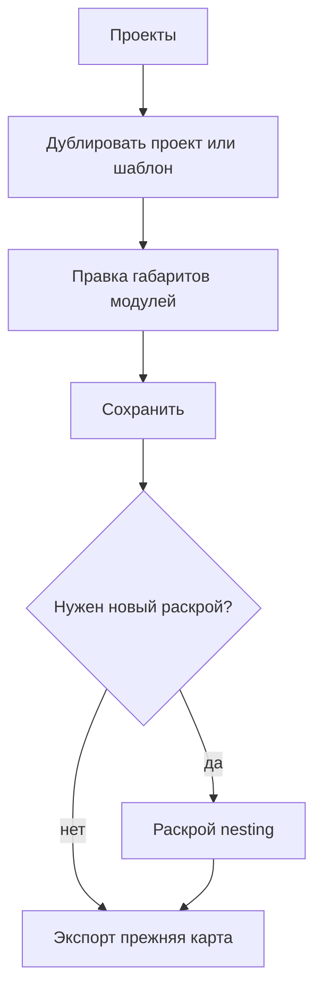

---
stepsCompleted:
  - step-01-init
  - step-02-discovery
  - step-03-core-experience
  - step-04-emotional-response
  - step-05-inspiration
  - step-06-design-system
  - step-07-defining-experience
  - step-08-visual-foundation
  - step-09-design-directions
  - step-10-user-journeys
  - step-11-component-strategy
  - step-12-ux-patterns
  - step-13-responsive-accessibility
  - step-14-complete
inputDocuments:
  - _bmad-output/planning-artifacts/prd.md
  - _bmad-output/planning-artifacts/product-brief-cut-stack.md
  - _bmad-output/planning-artifacts/mvp-scope-v1.md
  - _bmad-output/planning-artifacts/research/domain-raskroi-dsp-mdf-ruchnoi-research-2026-05-12.md
  - _bmad-output/planning-artifacts/architecture.md
  - _bmad-output/project-context.md
workflowType: ux-design
lastStep: 14
status: complete
completedAt: '2026-05-13'
designSystem: shadcn-ui
project_name: cut-stack
user_name: Yury_Aniskou
date: '2026-05-13'
---

# Спецификация UX-дизайна — cut-stack

**Автор:** Yury_Aniskou  
**Дата:** 2026-05-13

**Целевая библиотека компонентов:** [shadcn/ui](https://ui.shadcn.com/) поверх Next.js 16, React 19 и Tailwind CSS v4 в `apps/clients/web` (совместимость с официальными инструкциями shadcn для текущей связки — уточнить при инициализации CLI; при необходимости согласовать токены с `@theme` / CSS variables в `globals.css`).

---

## Executive Summary

### Project Vision

cut-stack — личный инструмент мастерской: от параметров мастерской и типовых корпусов до исполнимого цехового пакета (деталировка с кромкой и слоями размеров, guillotine-карта, CSV v1 и PDF, ограниченная фурнитура) с 3D-проверкой геометрии. Успех UX измеряется доверием к размерам («золотой тест с рулеткой»), а не «красотой» раскладки.

### Target Users

Один пользователь v1 — владелец мастерской, совмещающий проектирование и производство. Работает преимущественно за **desktop**, владеет профессиональной терминологией (kerf, trim, кромка, grain). Нужен быстрый повторяемый цикл без ручного переноса в Excel.

### Key Design Challenges

- **Три слоя размеров в UI:** чистовой, заготовка под кромку, размеры для пилы/листа — везде одинаковая семантика подписей и переключатели слоя при экспорте и в карточках деталей.
- **Совместная работа автоматики и ручной правки:** nesting и drag-and-drop правка карты без ощущения «сломал оптимизатор»; явные состояния пересчёта и отката (NFR Reliability).
- **Плотный рабочий стол:** 3D-вью, таблица деталей и 2D-карта листа на одном экране — осмысленная компоновка (панели, табы или split) без блокировки главного потока.
- **Интеграция shadcn/ui:** единая система форм и обратной связи (ошибки, disabled при расчёте), согласование с Tailwind v4 и правилами монорепо.

### Design Opportunities

- **Прозрачность цеха:** визуализация grain, нумерация резов и порядок guillotine — конкурентное отличие от «голого» optimizer.
- **Паттерны shadcn:** быстрый доступ к доступным, знакомым контролам (Sheet для боковых панелей, Dialog для экспорта, Table/Data table для деталировки, Progress для nesting).
- **Доверие через превью:** сопоставление «экран vs CSV/PDF» до выгрузки с дисклеймером (FR29).

## Core User Experience

### Defining Experience

**Главный цикл:** открыть или создать проект → задать/скорректировать габариты и состав модулей (шкаф, тумба, линейная или L-гардеробная) → проверить сборку в 3D → получить деталировку с явными слоями размеров → выбрать лист и получить **2–3 guillotine-варианта** или перезапустить расчёт → при необходимости **вручную довести карту** → экспортировать **CSV v1** и **PDF** и сверить перечень фурнитуры.

**Одно действие, без которого продукт не «существует» для пользователя:** уверенно получить **размеры и карту, согласованные с тем, что уйдёт на пилу**, без Excel и без смешения слоёв размеров.

**Что должно быть по возможности «бесшовным»:** применение **профиля мастерской** к новому проекту; копирование проекта под новый заказ; повторный пересчёт раскроя после правок без потери сохранённых данных.

### Platform Strategy

- **Платформа:** веб-приложение (Next.js), **desktop-first**; основной ввод — **мышь и клавиатура**.
- **Браузеры v1:** Chrome/Edge — основная линия; Safari и Firefox — поддерживаемые; сенсор у пилы **не** целевой сценарий v1.
- **Офлайн / PWA:** вне scope v1 (PRD).
- **Тяжёлые операции:** 3D и nesting не блокируют интерфейс; **индикатор прогресса** и возможность продолжать обзор/навигацию там, где это безопасно для целостности данных.

### Effortless Interactions

- Создание проекта **из профиля мастерской** без повторного ввода kerf, trim и пресетов листа.
- Переключение **слоя размеров** (чистовой / заготовка / для пилы) одним паттерном во всех экранах.
- **Grain lock** и ориентация декора — заметные, не спрятанные в «дополнительно».
- Экспорт: два явных действия (CSV, PDF) с **кратким превью полей** и дисклеймером перед сохранением файла.
- Компоненты **shadcn** для форм, таблиц, диалогов и прогресса — предсказуемое поведение фокуса, ошибок и disabled-состояний.

### Critical Success Moments

- **«Это лучше Excel»:** первая успешная выгрузка CSV/PDF по эталонному шкафу/тумбе без промежуточных таблиц.
- **«Вижу проблему до распила»:** 3D показывает стык L-гардеробной, зазоры фасадов или конфликт до заказа материала.
- **«Карта — моя»:** ручная правка guillotine-карты завершается без «сломанной» геометрии и с понятным откатом при сбое пересчёта.
- **Провал опыта, если не работает:** смешение слоёв размеров в экспорте; «зависание» UI без статуса при nesting; потеря проекта после ошибки расчёта.

### Experience Principles

1. **Цеховая правда важнее витрины** — каждый экран отвечает на вопрос «что режем и в каком порядке».
2. **Три слоя размеров всегда различимы** — одинаковые термины, бейджи или переключатель слоя, никаких скрытых преобразований без подписи.
3. **Автоматизация + человек в контуре** — автокарта — стартовая точка; ручная правка — норма, не авария.
4. **Неблокирующая тяжесть** — долгие расчёты сопровождаются прогрессом и сохраняют целостность последнего известного хорошего состояния.
5. **Консистентный UI-kit (shadcn)** — меньше когнитивной нагрузки на формах, таблицах и модальных сценариях экспорта.

## Desired Emotional Response

### Primary Emotional Goals

- **Контроль и ясность** — пользователь понимает, какой слой размеров сейчас на экране и что попадёт в CSV/PDF.
- **Спокойная уверенность** — «можно отнести в цех» без второго дня перепроверки в Excel.
- **Профессиональное уважение к опыту** — инструмент не спорит с технологом: ручная правка карты и grain lock воспринимаются как норма.

### Emotional Journey Mapping

- **Старт (новый проект / копия):** облегчение от того, что пресеты мастерской уже «подтянулись»; нет ощущения пустого листа в четырёх таблицах.
- **Ядро (параметры, 3D, деталировка):** сосредоточенность; снижение тревоги «я что-то перепутал в кромке» за счёт явных подписей и превью.
- **Раскрой:** терпеливое ожидание при расчёте (прогресс), затем удовлетворение от читаемой guillotine-карты; гордость за «дожал руками», если правил карту.
- **Экспорт:** чувство завершённости; краткое напряжение перед скачиванием снимается превью полей и дисклеймером (прозрачность ответственности).
- **Ошибка / сбой расчёта:** не паника, а **предсказуемость** — сообщение, сохранённый проект цел, есть путь «повторить» или откатить карту.
- **Возврат в продукт:** привычка и доверие — «мой стандарт мастерской уже здесь».

### Micro-Emotions

- **Доверие > скепсис** — за счёт согласованности терминов, повторяемых паттернов shadcn и отсутствия «магических» пересчётов без объяснения слоя размеров.
- **Уверенность > замешательство** — переключатель слоя размеров и подсказки по trim/kerf в контексте листа.
- **Спокойствие > тревога при ожидании** — видимый прогресс nesting, отсутствие «мёртвого» UI.
- **Гордость за результат > раздражение** — успешный экспорт без Excel как маленькая победа; избегать восторга «игрушечного» UI в ущерб читаемости цеха.

### Design Implications

- **Контроль:** явные режимы просмотра размеров, история/откат карты, дублирование проекта перед рискованными экспериментами с раскладкой (по мере реализации).
- **Спокойствие:** нейтральная типографика shadcn, предсказуемые модальные окна экспорта, отсутствие агрессивных анимаций вокруг расчётов.
- **Доверие:** превью экспорта, дисклеймер FR29 без юридического запугивания; крупные подписи на превью PDF-карты.
- **Избегать:** «умных» подписей, скрывающих физику (кромка/kerf); пустых успех-тостов без проверяемого действия; внезапных перезаписей карты без подтверждения.

### Emotional Design Principles

1. **Спокойная мастерская**, не маркетинговый лендинг — эмоции через порядок и читаемость, не через эффекты.
2. **Уважение к страху ошибки** — любой шаг, влияющий на пилу, подкреплён визуальной и текстовой ясностью.
3. **Прозрачность вместо «волшебства»** — пользователь чувствует себя автором решения, а не зрителем чёрного ящика.
4. **Восстановление после сбоя — часть эмоционального контракта** — ошибка не должна ощущаться как потеря дня работы.

## UX Pattern Analysis & Inspiration

### Inspiring Products Analysis

**Табличные инструменты (Excel, Google Sheets)** — то, от чего уходит пользователь: сильная привычка к сетке чисел и копированию строк. **Урок для cut-stack:** сохранить **табличную предсказуемость** в деталировке (сортировка, фильтры, фиксированные колонки), но убрать боль ручного переноса формул между «чистовой» и «на пилу».

**Профессиональные «плотные» веб-приложения** (например, Linear, Notion, Figma в режиме файла) — быстрый доступ к действиям, боковые панели, split-view, клавиатурная навигация по формам. **Урок:** рабочий стол cut-stack как **IDE мастерской** — слева/центр контекст проекта, справа или вкладками деталировка / карта / 3D без скачков в «другой продукт».

**Веб-оптимизаторы раскроя (CutPlan, CutOptim и аналоги)** — быстрый ввод размеров, grain, PDF. **Урок:** не конкурировать только % утилизации; выигрывать **цеховой вывод** (порядок guillotine-резов, подписи, связь деталь ↔ лист) и **двухслойной семантикой**, которой у generic-инструментов нет.

**RU desktop-контуры (Базис, Астра, МАСТЕР — по исследованию)** — ручная правка карты, этикетки, склад. **Урок v1:** перенять ожидание **«карту можно довести руками»** и уважение к **grain**; не переносить сложность ERP/склада.

**Экосистема shadcn / админ-панели на Tailwind** — спокойная типографика, предсказуемые формы и модалки. **Урок:** визуальная дисциплина без «конфигуратора мебели из рекламы».

### Transferable UX Patterns

**Навигация**

- **Верхняя или боковая навигация по разделам** «Проекты | Мастерская | [текущий проект]» — снижает потерю контекста.
- **Внутри проекта — табы или split:** «Параметры / 3D / Детали / Раскрой / Фурнитура / Экспорт» — соответствует циклу PRD.

**Интеракции**

- **Переключатель слоя размеров** (чистовой / заготовка / пиля) — как «режим просмотра» в CAD-light; один паттерн в таблице и в карточке детали.
- **Варианты раскладки** — карточки или вкладки с «Вариант A/B/C» + метрики (листов, отход) без доминирования над исполнимостью.
- **Ручная правка карты** — drag-and-drop или пошаговый редактор с валидацией guillotine; явная кнопка «Сбросить к авто».
- **Долгие операции** — индикатор прогресса + неблокирующий UI (см. architecture).

**Визуал**

- **Высокий контраст для карты листа** — крупные размеры линий, нумерация резов (ориентир приказа 835н).
- **shadcn `Table`, `Sheet`, `Dialog`, `DropdownMenu`, `Tooltip`** — единообразие форм настроек мастерской и фурнитуры.

### Anti-Patterns to Avoid

- **«Только yield»** — давление на процент без объяснения исполнимости и слоя «на пилу».
- **Скрытые пересчёты** — изменение заготовки без явной связи с кромкой/kerf.
- **Маркетинговый 3D** — глянец вместо читаемых зазоров и стыков.
- **Мобильный-first у пилы** в v1 — обещания, которые PRD не поддерживает.
- **Пустой экран при nesting** — ломает спокойствие и доверие.
- **Смешение `@repo/ui` и shadcn** без правил — двойные стили кнопок и полей (зафиксировать в разделе Design System Foundation).

### Design Inspiration Strategy

**Принять:** табличная деталировка; split/табы рабочего места; явный прогресс тяжёлых задач; модальные потоки экспорта на базе shadcn.

**Адаптировать:** опыт desktop-раскроя (ручная правка, варианты карт) в **веб** с сохранением лёгкости деплоя и без склада.

**Избегать:** generic cut-list без цеховой семантики; визуальный шум, мешающий чтению карты; необоснованные обещания mobile/offline.

**Связь с эмоциональными целями:** спокойствие и контроль через предсказуемые паттерны shadcn и «профессиональную плотность» без хаоса Excel.

## Design System Foundation

### 1.1 Design System Choice

**База:** [shadcn/ui](https://ui.shadcn.com/) — копируемые в репозиторий компоненты на **React** + **Radix UI** + **Tailwind CSS**, согласованные с **Next.js App Router** и **TypeScript**.

**Позиционирование:** не «чужая» закрытая библиотека, а **набор примитивов и паттернов в коде** приложения, которые можно точечно менять под цеховую семантику (подписи, плотность таблиц, контраст карты).

### Rationale for Selection

- **Скорость и консистентность** для соло-разработки: формы, диалоги, таблицы, выпадающие списки, прогресс — без изобретения дизайн-системы с нуля.
- **Уже есть Tailwind v4** в `apps/clients/web` — shadcn опирается на те же утилиты и CSS variables; меньше второго параллельного стека.
- **Доступность из коробки** (Radix): фокус, клавиатура, базовые роли — важны для длинных сессий у desktop.
- **Соответствие эмоциональным целям:** спокойный «профессиональный» визуальный язык без маркетингового глянца.
- **Гибкость под PDF/цех:** кастомные варианты плотности и типографики для превью карты не конфликтуют с тем, что компоненты — локальные файлы, а не непрозрачный npm-UI-kit.

### Implementation Approach

- **Размещение:** инициализировать shadcn CLI в **`apps/clients/web`** (путь компонентов по умолчанию `src/components/ui` или согласованный alias); следовать актуальной документации shadcn для **Tailwind v4** и **React 19**.
- **Импорт:** использовать сгенерированные компоненты из `@/components/ui/...` в feature-коде; интерактивные обёртки — с `"use client"` по правилам Next.js.
- **Связь с `@repo/ui`:**  
  - **Вариант A (рекомендуется для v1):** новые фичи cut-stack строить на shadcn в web; `@repo/ui` оставить для уже существующих простых демо-компонентов или постепенно заменить re-export’ами обёрток над shadcn.  
  - **Вариант B:** вынести обёртки shadcn в `@repo/ui` после стабилизации набора — только если появится второй клиент в монорепо; до этого не усложнять граф зависимостей.
- **Тяжёлые зоны (3D, canvas раскроя):** не смешивать с примитивами shadcn внутри одного файла; отдельные client-модули + shadcn только для хрома (панели, кнопки, Sheet).

### Customization Strategy

- **Токены:** согласовать `globals.css` — переменные shadcn (`--background`, `--foreground`, радиусы) с существующим `@theme inline` / Geist; одна палитра для светлой темы v1 (тёмная — по явному scope).
- **Типографика:** базовый текст интерфейса — из layout/shadcn; **карта листа** — отдельный масштаб (классы или вариант `data-density="shop-floor"` для превью и PDF-related UI).
- **Компонентный roadmap:** приоритет установки — `Button`, `Input`, `Label`, `Select`, `Checkbox`, `Tabs`, `Table`, `Dialog`, `Sheet`, `DropdownMenu`, `Tooltip`, `Progress`, `Separator`, `Card`, `Alert`, `ScrollArea`; далее — `Form` (react-hook-form + zod) для профиля мастерской и параметров корпуса.
- **Локализация:** строки UI на русском; формат чисел **десятичная запятая** для отображения по желанию пользователя — отдельное согласование с CSV v1 (экспорт может оставаться с точкой по спецификации).

## 2. Определяющий пользовательский опыт (фокус)

### 2.1 Defining Experience

**Одна формулировка для «рассказать коллеге»:** «Задал корпус и мастерскую — получил **деталировку и guillotine-карту в нужном слое размеров**, проверил в 3D, **выгрузил CSV и PDF**, что можно нести в цех».

**Если сделать идеально одну вещь:** пользователь **без сомнений** понимает, **какой размер уйдёт на пилу** и **в каком порядке режется лист**, с возможностью **довести карту вручную** и **не потерять проект** при пересчёте.

### 2.2 User Mental Model

- **Сейчас:** Excel/таблицы, ручной перенос между «чистовой», заготовкой под кромку и размером для пилы; отдельные оптимизаторы раскроя без полной связки с мебельной геометрией и grain.
- **Ожидание:** «**Один проект = один источник правды**» для модулей, кромки, листа и экспорта; правка карты — **нормальный** шаг, а не сбой системы.
- **Риски путаницы:** скрытый пересчёт при смене кромки/kerf; неочевидный слой размеров в таблице vs PDF; «магический» nesting без статуса и отката.

### 2.3 Success Criteria

- Пользователь **за ≤ несколько минут** на эталонном сценарии проходит путь до **проверяемой** выгрузки (CSV/PDF) с **совпадением** превью и файла (в границах FR29).
- **Переключатель слоя размеров** даёт **мгновенно узнаваемое** изменение подписей в деталировке и в контексте раскроя.
- После **ручной правки** карты пользователь видит **валидность guillotine** или **ясную ошибку** и может **вернуться к авто-варианту** без потери проекта.
- Долгие операции: **прогресс + неблокирующий** интерфейс там, где это безопасно по целостности данных.

### 2.4 Novel UX Patterns

- **В основном устоявшиеся паттерны:** формы, таблицы, табы/split, модалки экспорта — через **shadcn/Radix** (знакомая модель desktop-веба).
- **Комбинация с отраслевой спецификой:** связка **3D корпус ↔ таблица деталей ↔ 2D-карта листа** с **явной семантикой трёх слоёв размеров** и **ручным донастроением** раскладки — это **склейка знакомых UI-идей в новом контексте**, а не полностью новый жест.
- **Где нужно «учить»:** первый проход по **слоям размеров** и по **grain lock** — короткие подсказки в UI (Tooltip/one-time hint), без туториала на десять экранов.

### 2.5 Experience Mechanics

**1. Initiation:** из списка проектов или копии; профиль мастерской уже задаёт kerf/trim/лист — пользователь открывает **текущий проект** и переходит к параметрам / 3D.

**2. Interaction:** редактирование модулей и кромки; просмотр 3D; чтение деталировки с **переключением слоя**; выбор листа; запуск **2–3 вариантов** раскроя; при необходимости — **правка карты** (drag/шаги, в зависимости от реализации).

**3. Feedback:** индикаторы пересчёта; **превью** экспорта; нумерация резов и читаемая карта; сообщения об ошибках **с сохранением** последнего согласованного состояния проекта.

**4. Completion:** успешная выгрузка **CSV v1** и **PDF**; пользователь может **сверить** перечень фурнитуры и закрыть цикл; следующий шаг — новый заказ (копия проекта) или правка под другой лист.

## Visual Design Foundation

### Color System

- **База:** светлая тема v1; семантика **shadcn** через CSS variables (`--background`, `--foreground`, `--muted`, `--border`, `--primary`, `--destructive`, `--ring` и т.д.), синхронизированная с `@theme inline` в `apps/clients/web`.
- **Характер палитры:** нейтральный «инструментальный» фон (не чисто белый маркетинг), приглушённые вторичные поверхности для панелей и таблиц; **primary** — сдержанный акцент для основных действий (сохранить, рассчитать, экспорт), без «кричащего» бренд-цвета мебельного лендинга.
- **Семантика состояний:** `destructive` — ошибки и необратимые действия; отдельный визуальный паттерн для **предупреждений** раскроя (несовпадение слоя, риск пересчёта) — через `Alert` / бордер + иконку, не только красный текст.
- **Карта листа и PDF-related UI:** повышенный контраст линий и подписей (отдельные utility-классы или токены), согласованные с принципом «цеховая правда»; фон canvas может быть чуть теплее/холоднее основного `--background` для отделения зоны чертежа от хрома приложения.
- **Контраст:** ориентир **WCAG 2.1 AA** для основного текста и интерактивных элементов; для второстепенных подписей на карте — минимум читаемость при типичной яркости монитора в цехе (по возможности не опускаться ниже разумного порога без явного «чернового» режима).

### Typography System

- **Основной шрифт интерфейса:** **Geist Sans** (уже в `@theme` как `--font-sans`) — нейтральная геометрия, хорошая читаемость в плотных формах и таблицах.
- **Моноширинный:** **Geist Mono** для колонок с размерами в мм, кодов деталей, технических идентификаторов CSV-превью — снижает ошибки при сверке «глазами».
- **Иерархия:** масштаб shadcn/Tailwind по умолчанию (`text-sm` для основного UI, `text-xs` для вторичных подписей в таблицах); заголовки экранов — явный уровень без «рекламных» размеров.
- **Зона карты листа:** на шаг **на ступень крупнее** базового `body` для размерных линий и нумерации резов (отдельный scope классов или `data-density="shop-floor"`), без смены семейства шрифта в v1.
- **Локаль:** русский UI; числа — согласование отображения (запятая/точка) с продуктовыми правилами экспорта отдельно.

### Spacing & Layout Foundation

- **Ритм:** базовая сетка **4px** (стандарт Tailwind); для плотных таблиц и панелей инструментов — преимущественно **8–12px** между связанными элементами, **16–24px** между логическими блоками экрана.
- **Плотность:** **desktop-first, «профессиональная плотность»** — не воздушный маркетинговый лендинг; допускаются компактные строки таблицы при сохранении высоты кликабельной зоны и фокуса.
- **Сетка рабочего стола:** гибкий **split** или табы: основная колонка под 3D/карту, боковая/нижняя зона под параметры и деталировку — пропорции задаются responsive breakpoints для широких экранов (основной сценарий).
- **Компоненты shadcn:** стандартные `padding` карточек и `Sheet`/`Dialog` — без избыточных полей, чтобы на одном экране умещались карта + ключевые контролы.
- **Скролл:** явные **ScrollArea** для длинных списков деталей; фиксация шапки таблицы при вертикальном скролле (паттерн data table).

### Accessibility Considerations

- **Клавиатура и фокус:** видимый `--ring` для всех интерактивных контролов Radix/shadcn; логичный tab order в формах мастерской и экспорта.
- **Не полагаться только на цвет:** ошибки валидации — текст + иконка; слои размеров — подпись или бейдж, не только цвет линии на карте.
- **Motion:** сдержанные переходы (shadcn defaults); избегать отвлекающих анимаций во время nesting.
- **Масштаб браузера:** критичные экраны (карта, экспорт) должны оставаться **юзабельными при ~110–125%** масштаба ОС у пользователей со сниженным зрением — проверка на этапе реализации.

## Design Direction Decision

### Design Directions Explored

Визуальная витрина: `_bmad-output/planning-artifacts/ux-design-directions.html` — **8** направлений:

1. **Боковая навигация «IDE мастерской»** — слева глобальный контекст, в центре табы проекта (Параметры / 3D / Детали / Раскрой), зона карты рядом или под основным контентом.
2. **Светло-серая нейтраль** — максимально близко к дефолтной светлой теме shadcn, быстрый старт.
3. **Тёмный «цех»** — снижение бликов, отдельные токены для карты; **вне приоритета v1**, зафиксировать как опциональный backlog.
4. **Тёплый фон зоны чертежа** — нейтральный хром, слегка тёплый фон только у 2D-карты («бумага»), усиление фокуса «что режем».
5. **Карта снизу на всю ширину** — чертёжный стол; сильно для ручной правки guillotine.
6. **Ультраплотный табличный** — много строк деталировки, ужатый 3D; риск перегруза, не базовый выбор.
7. **Горизонтальная верхняя навигация** — без боковой колонки; проще на узких окнах, слабее «IDE»-модель.
8. **Минимум хрома** — узкие отступы, почти инженерный вид; меньше совпадения с мягким shadcn-default.

### Chosen Direction

**База для v1: направление 1** (боковая навигация + табы внутри проекта + split для 3D / деталей / карты).

**Уточнение:** при реализации экрана раскроя допускается перенять из **направления 4** только **тёплый фон canvas** карты листа (остальной UI — нейтральный shadcn/Geist). Элементы **направления 5** (карта снизу на всю ширину) — как **альтернативный layout** вкладки «Раскрой» на широких мониторах (breakpoint), не как единственный каркас на всех разрешениях.

### Design Rationale

- Соответствует **определяющему опыту** и **эмоциональным целям** (контроль, спокойствие, «профессиональная плотность»).
- Совместимо с **shadcn** (`Sidebar`-паттерн через layout, `Tabs`, `Sheet`, `Table`) без кастомного «второго приложения».
- Тёмная тема и ультраплотность отложены — меньше поверхности ошибок в v1 при соло-разработке.

### Implementation Approach

- Зафиксировать **layout shell** в `apps/clients/web`: левый rail (проекты, мастерская), верх project chrome с табами, основная область — resizable split (например `react-resizable-panels` при появлении необходимости) или фиксированные пропорции на первом релизе.
- Токены: дефолтные переменные shadcn + опциональный класс для зоны карты (тёплый `--card` / background override только на контейнере canvas).
- Витрина HTML остаётся **референсом** для обсуждения; финальный UI — в коде по этому решению.

## User Journey Flows

Основа — PRD (`## User Journeys`): один пользователь, четыре нарратива. Ниже — **механика экранов** в духе выбранного направления 1 (sidebar + табы проекта).

### 1. Новый шкаф под заказ (основной путь)

**Цель:** от габаритов заказа до CSV/PDF и списка фурнитуры без Excel, с согласованными слоями размеров.

**Ключевые шаги:** Мастерская (при необходимости уточнить пресеты) → новый проект → типовой шкаф, параметры, кромка → 3D-проверка → деталировка с переключателем слоя → выбор листа → nesting (2–3 варианта) → при необходимости правка карты → экспорт CSV + PDF → сверка фурнитуры.

**Точки риска:** первый проект без профиля мастерской; смена слоя размеров неочевидна; ожидание nesting без статуса.

### 2. Правка раскладки и зерно (краевой, но нормальный путь)

**Цель:** исправить декор/grain без пересборки в Excel и без «поломки» проекта.

**Ключевые шаги:** вкладка раскроя или параметры → **Grain lock / ориентация** → правка карты → валидация guillotine → пересчёт деталей при необходимости → повторный экспорт.

**Восстановление:** при сбое пересчёта — сообщение, проект цел, «повторить расчёт» / откат к последнему сохранённому состоянию карты (NFR из PRD).

### 3. L-гардеробная — стык и фасады

**Цель:** тот же контур, что у простого шкафа, с акцентом на **угловой стык** и зазоры; единая деталировка и раскрой.

**Ключевые шаги:** выбор композиции L (модули плеч) → параметры секций и фасадов «не на каждой» → 3D стыков и зазоров → деталировка → раскрой → фурнитура по сценариям v1 → экспорт.

### 4. Повторный заказ (профиль мастерской уже задан)

**Цель:** не вводить kerf/trim/лист заново; быстрый цикл под новый заказ.

**Ключевые шаги:** копия проекта или новый из пресета → смена габаритов/модулей → сохранение → пересчёт при необходимости → экспорт по тем же правилам.

### Journey Patterns

- **Вход в ценность:** всегда через **Проекты** или **Мастерская**; глобальный контекст не теряется (sidebar).
- **Внутри проекта:** табы **Параметры → 3D → Детали → Раскрой → Фурнитура → Экспорт** (или объединение Фурнитура/Экспорт по реализации), единый **переключатель слоя размеров** на табах Детали и Раскрой.
- **Тяжёлые шаги:** nesting и тяжёлый пересчёт — **прогресс**, неблокирующий UI где безопасно; явный **error recovery** без порчи сохранённого проекта.
- **Подтверждение риска:** экспорт и деструктивные сбросы карты — **Dialog** с превью/дисклеймером где уместно (FR29).

### Flow Optimization Principles

1. **Минимум шагов до первой деталировки** — пресет мастерской и типовой корпус по умолчанию.
2. **Один источник правды по слою размеров** — переключатель синхронизирован между таблицей, карточкой детали и экспортом.
3. **Ручная правка не наказывается** — не считать ошибкой; валидация guillotine сразу на месте.
4. **Повторяемость заказа** — копия проекта и неизменные правила мастерской без повторного ввода kerf/trim.
5. **Сверка перед файлом** — короткое превью полей экспорта; не раздувать модалку вторичными опциями v1.

## Component Strategy

### Design System Components

Из **shadcn/ui** (см. Design System Foundation) покрывают большую часть хрома и форм:

- **Навигация и структура:** `Button`, `Separator`, `Tabs`, `Sheet`, `ScrollArea`, `DropdownMenu`, `Tooltip`.
- **Ввод данных:** `Input`, `Label`, `Select`, `Checkbox`, `Form` + react-hook-form + zod (профиль мастерской, параметры корпуса, фурнитура).
- **Плотные списки:** `Table` (с фиксированной шапкой при скролле — композиция layout + `ScrollArea`).
- **Модальные сценарии:** `Dialog` (экспорт, подтверждение сброса карты, дисклеймер FR29), `Alert` для inline-предупреждений раскроя.
- **Обратная связь:** `Progress` (nesting / пересчёт), `Skeleton` при первой загрузке тяжёлых панелей (по мере внедрения).

Эти примитивы реализуют **journey patterns** из шага 10 без дублирования `@repo/ui` (v1: новые экраны на shadcn в `apps/clients/web`).

### Custom Components

Компоненты ниже **нет** в shadcn как готовых блоков; строятся на токенах дизайн-системы + React.

#### 1. `DimensionLayerSwitch` (переключатель слоя размеров)

- **Назначение:** единый паттерн «чистовой / заготовка под кромку / на пилу» на табах Детали и Раскрой и в превью экспорта.
- **Состав:** группа `ToggleGroup` (Radix) или сегментированный контроль в стиле shadcn; подпись текущего слоя; опционально `Tooltip` с кратким пояснением.
- **Состояния:** три значения; `disabled` во время небезопасного пересчёта (если продуктово запрещено переключать слой до завершения job).
- **Доступность:** `role="radiogroup"`, стрелки между опциями, видимый фокус.

#### 2. `SheetCutMap` (2D-карта листа, guillotine)

- **Назначение:** отображение и (позже) ручная правка раскладки; нумерация резов; grain; варианты A/B/C.
- **Состав:** контейнер с **canvas** или SVG; оверлей подписей размеров; легенда; панель инструментов (zoom, fit, «сброс к авто») на `Button` + `Tooltip`.
- **Состояния:** пустой лист / загрузка / варианты раскроя / режим правки / ошибка валидации guillotine; опциональный **тёплый фон** зоны (направление 4).
- **Доступность:** фокус на панели инструментов; для canvas — текстовая сводка или таблица «порядок резов» как **деградация** для клавиатуры (backlog, если не в v1 — заложить место в layout).

#### 3. `Viewport3DPanel` (оболочка вокруг 3D-сцены)

- **Назначение:** единая рамка для Three.js/React-Three-Fiber: тулбар вида, full-screen, подсказки по конфликтам геометрии.
- **Состав:** `Card` или кастомный bordered div; слот для canvas; полоса действий shadcn `Button` / `Toggle`.
- **Состояния:** загрузка модели, ошибка рендера, «конфликт» с callout-текстом из доменной логики.

#### 4. `NestingVariantCards` (2–3 варианта раскроя)

- **Назначение:** сравнение вариантов по листам/отходу без доминирования над исполнимостью.
- **Состав:** `Card` × N, выбранный вариант подсвечен; метрики `text-sm` + `mono` для чисел.
- **Состояния:** пересчёт (skeleton или disabled карточки), нет вариантов (empty state).

#### 5. `ExportDialog` (композиция)

- **Назначение:** единый поток CSV v1 + PDF с превью полей и дисклеймером.
- **Состав:** `Dialog` + форма полей + превью таблица; не дублировать три отдельных «магических» мастера — один диалог с табами или секциями при необходимости.

#### 6. `ProjectAppShell`

- **Назначение:** sidebar (Проекты, Мастерская) + project chrome + слот контента табов.
- **Реализация:** layout Next.js + композиция shadcn; при необходимости `react-resizable-panels` для split.

### Component Implementation Strategy

- **Кастом только там, где нет примитива:** карта, 3D-оболочка, переключатель слоя, карточки вариантов, shell — в `apps/clients/web/src/components` (или `features/*/components`) с префиксом домена по желанию (`cut/`).
- **Токены:** цвет линий карты, фон canvas, плотность — через CSS variables / классы Tailwind, не хардкод hex в canvas без синхронизации с темой.
- **Клиентские границы:** `SheetCutMap`, `Viewport3DPanel` — `"use client"`; страницы по возможности остаются серверными с прокидыванием данных.

### Implementation Roadmap

**Фаза 1 — каркас и доверие к данным**

- `ProjectAppShell` + табы проекта.
- `DimensionLayerSwitch` + таблица деталей на `Table`.
- `ExportDialog` (минимальный CSV/PDF).

**Фаза 2 — раскрой**

- `NestingVariantCards` + `Progress`.
- `SheetCutMap` read-only, затем режим правки и валидация.

**Фаза 3 — геометрия и фурнитура**

- `Viewport3DPanel` + сценарии L-стыка.
- Формы фурнитуры на `Form` + списки на `Table` / `Sheet`.

**Фаза 4 — полировка**

- Empty states, skeletons, улучшение доступности canvas (сводка резов), опциональный layout «карта снизу» на широком breakpoint.

## UX Consistency Patterns

Платформа v1 — **desktop-first**; мобильные исключения — только там, где не ломают цеховой сценарий (см. отдельный шаг responsive/accessibility).

### Button Hierarchy

- **Primary (`Button` default):** одно главное действие на экране или в модалке — «Сохранить», «Рассчитать раскрой», «Экспортировать», «Подтвердить».
- **Secondary (`Button variant="outline"` или `ghost`):** «Отмена», «Назад», вторичные действия без изменения критичных данных.
- **Destructive (`Button variant="destructive"`):** только для необратимого удаления данных (проект, сброс карты без отката) — всегда с `Dialog` и явным текстом последствий.
- **Link-style:** навигация «Открыть в…», «Подробнее» — `Button variant="link"` или текстовая ссылка, не смешивать с primary.
- **Toolbar на карте/3D:** плотный ряд `ghost`/`outline` иконок + `Tooltip`; не дублировать primary из модалки на той же панели.

### Feedback Patterns

- **Успех (некритичный):** короткий `Toast`/sonner только для завершённых действий («Проект сохранён»); избегать тоста без проверяемого эффекта.
- **Ошибка формы:** `FormMessage` под полем + `aria-invalid`; для блокирующих ошибок — `Alert` вверху формы с кратким резюме.
- **Ошибка расчёта / сеть:** `Alert` variant destructive или отдельный блок с **действиями** «Повторить»; v1 без отдельной «поддержки».
- **Предупреждение раскроя:** `Alert` нейтральный или предупреждающий стиль (не путать с error); текст + иконка; при необходимости ссылка «Подробнее» в `Sheet`.
- **Прогресс:** `Progress` или индетерминированный индикатор в зоне, где запущен job; не блокировать весь shell без причины.
- **Empty state:** заголовок + одно предложение + одно primary-действие («Создать проект», «Задать лист»).

### Form Patterns

- **Одна колонка** для длинных форм мастерской и корпуса; группировка полей через `Card` + заголовки секций.
- **Валидация:** onBlur или onSubmit для тяжёлых полей; не дребезжать при каждом символе для размеров в мм.
- **Единицы и числа:** суффикс «мм» в `Label` или `Input` group; отображение с запятой — по продуктовым правилам; zod-схемы синхронны с доменом.
- **Disabled:** явная причина рядом или в `Tooltip` («Дождитесь окончания расчёта»).

### Navigation Patterns

- **Глобально:** sidebar — «Проекты», «Мастерская»; текущий проект виден в chrome.
- **Внутри проекта:** горизонтальные `Tabs`; сохранение активной вкладки в URL query (`?tab=cut`) по возможности для восстановления после F5.
- **Breadcrumb:** опционально v1; достаточно заголовка проекта + табов.
- **Deep link:** позже; v1 — не обещать публичные ссылки.

### Additional Patterns

- **Модалки и оверлеи:** `Dialog` для фокусных задач (экспорт, подтверждение); `Sheet` для боковых панелей настроек, не перекрывающих карту целиком на большом экране.
- **Таблицы:** сортировка по клику на заголовок где уместно; фиксированная шапка; чёткое выделение строки при hover; выбор строки — только если нужен bulk v2+.
- **Переключатель слоя размеров:** всегда компонент `DimensionLayerSwitch` — не воссоздавать ad-hoc в каждом экране.
- **Карта и 3D:** курсорные подсказки в `Tooltip`; клавиатурная деградация — см. roadmap компонента `SheetCutMap`.
- **Копирование проекта:** в меню `DropdownMenu` строки проекта; подтверждение не требуется, undo не обещаем v1 — явное название копии по умолчанию.

## Responsive Design & Accessibility

### Responsive Strategy

- **Desktop (основной сценарий, ≥1280px):** split 3D / детали / карта; sidebar; плотная таблица; опционально «карта снизу» на очень широких экранах (см. Design Direction Decision).
- **Ноутбук (1024–1279px):** те же паттерны; при нехватке ширины — схлопывание split в вертикальный стек или табы без потери функций v1.
- **Планшет (768–1023px):** не целевой сценарий цеха; layout остаётся читаемым: sidebar может стать `Sheet` по кнопке меню; таблица с горизонтальным скроллом внутри `ScrollArea`; карта и 3D не обязаны умещаться одновременно — переключение табами приемлемо.
- **Мобильный (ширина экрана меньше 768px):** **не** обещать полноценный рабочий цикл v1 (PRD); минимум — просмотр списка проектов / read-only деталей или заглушка «Откройте на desktop» — решение за реализацией, в UX не позиционировать как «пилу с телефона».

**Подход:** **desktop-first** медиазапросы (`min-width`), расширение layout вниз по ширине, а не обрезание desktop до мобильного.

### Breakpoint Strategy

- Опора на **Tailwind defaults:** `sm` 640px, `md` 768px, `lg` 1024px, `xl` 1280px, `2xl` 1536px.
- **Ключевые пороги для cut-stack:** `lg` — появление устойчивого split; ниже `lg` — упрощённая компоновка; `md` — переключение sidebar → overlay при необходимости.
- Кастомные брейкпоинты только при измеренной боли (например фиксированная минимальная ширина canvas карты).

### Accessibility Strategy

- **Целевой уровень:** **WCAG 2.1 Level AA** для основного UI (формы, навигация, модалки, таблица в объёме, достижимом без canvas-only потоков).
- **Контраст:** текст и интерактивы — как минимум **4.5:1** для обычного текста; линии и подписи на карте — максимально близко к AA в светлой теме; при конфликте «эстетика чертежа» vs контраст — приоритет читаемости в зоне экспорта/превью.
- **Клавиатура:** полный проход по формам, `Dialog`/`Sheet` с ловушкой фокуса (Radix), видимое кольцо фокуса (`--ring`).
- **Скринридеры:** семантические заголовки, `aria-labelledby` для диалогов, подписи полей, статус прогресса через `aria-busy` / live region при длительном nesting.
- **Canvas/SVG карта:** не полагаться на цвет; дублировать критичную информацию текстом (сводка резов, см. roadmap `SheetCutMap`); зона карты — `application` role только если есть клавиатурная модель, иначе избегать ложных ролей.

### Testing Strategy

- **Responsive:** ручная проверка в Chrome DevTools device mode + реальное окно 1366×768 и широкий монитор; Safari/Firefox выборочно на формах и экспорте.
- **Доступность:** **axe** или Lighthouse в CI по основным маршрутам; ручной проход Tab по «Мастерская → проект → экспорт»; VoiceOver (macOS) на одном happy-path.
- **Регрессия:** чеклист перед релизом: контраст primary/destructive, фокус в модалке, disabled при расчёте.

### Implementation Guidelines

- **Вёрстка:** `rem`/`%` для типографики и отступов; избегать фиксированных `px` для высоты всего приложения.
- **Touch:** если планшет поддерживается, целевые зоны **не меньше ~44×44px** для кнопок вне плотных таблиц; в таблице — осознанный компромисс с горизонтальным скроллом.
- **Масштаб ОС 110–125%:** проверка карты и модалок экспорта (см. Visual Foundation).
- **Реализация:** семантический HTML (`main`, `nav`, `section`), shadcn/Radix уже дают часть ARIA; не удалять фокус-стили глобально.

